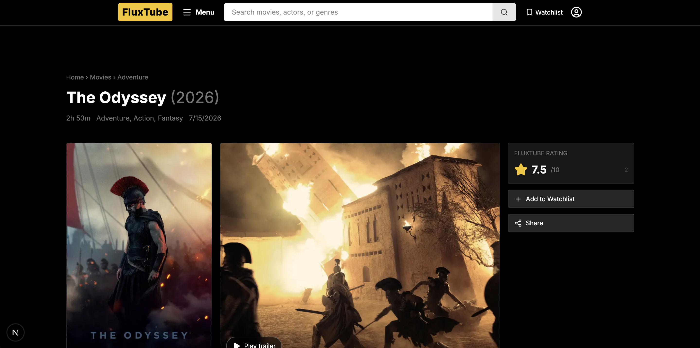
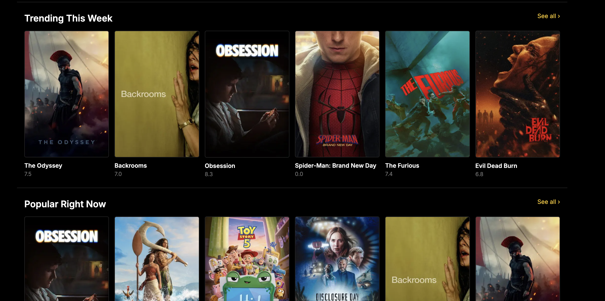
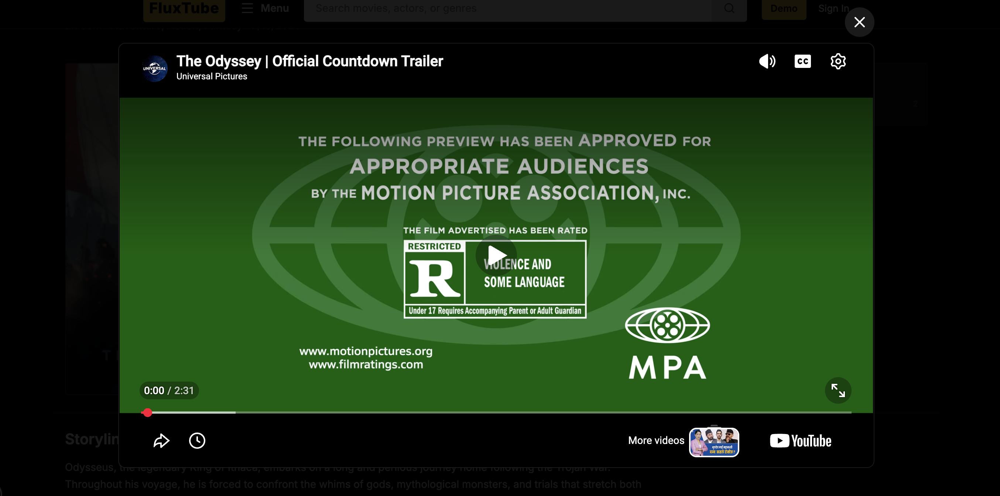
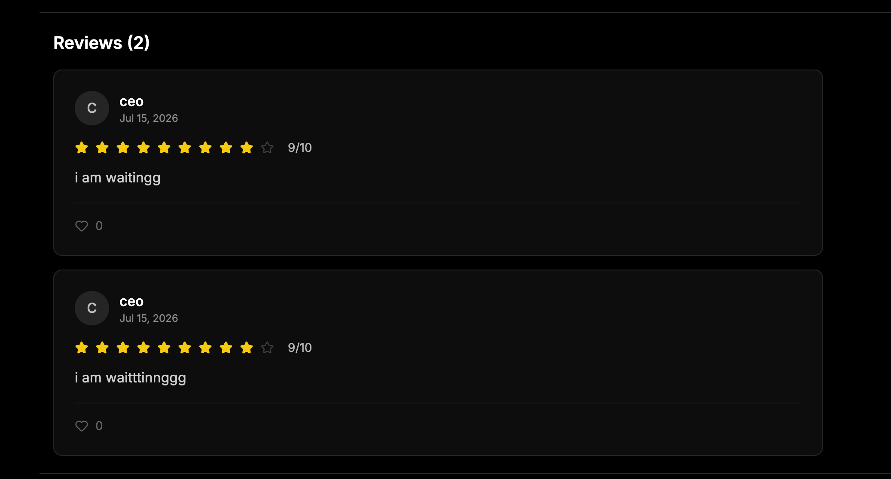

# FluxTube

Fluxtube is a imdb like movie and tv shows review platform, it has all the moveis you want to review or see review, you can make your watchlist and know which you have already watched. It's great for movie and tv shows watchers  :)



## Motivation 

I really wanted to know make a platform for people who watch movies and tvshow like me who wanted to see tracking movie and tvshows. I also wanted a app to share my reviews regarding that movie and read for other moves (YEE imdb but i want my own)



## What I learned

I understood how to work with images, how to show data, work with api and understand it, I understood how to understand the tree structure of json when i call the api. I learnt how to make api to ui



## What this project does

- Users can come to site and see movies and their reviews from out members

- User can login and write reviews of their own and contribute

- User can add movies and tv shows to their watchlist and watched list

- User can view other profile page to see what is

- User have their own feed page showing all the latest titles etc.. 

- Search functionality to search movies and userrs



## Folder structure

(btw this tree is generated by online site which takes github link and generates tree structure :D so no ai )

```text
fluxtube/
├── drizzle/
│   └── meta/
├── public/
├── screenshot/
└── src/
    ├── app/
    │   ├── api/
    │   │   ├── auth/
    │   │   │   ├── login/
    │   │   │   ├── signup/
    │   │   │   └── verify/
    │   │   ├── follows/
    │   │   │   └── check/
    │   │   ├── likes/
    │   │   ├── reviews/
    │   │   │   └── [id]/
    │   │   ├── users/
    │   │   │   ├── [id]/
    │   │   │   ├── search/
    │   │   │   └── suggested/
    │   │   ├── watched/
    │   │   └── watchlist/
    │   ├── feed/
    │   │   └── [videoId]/
    │   ├── login/
    │   ├── movie/
    │   │   └── [id]/
    │   ├── profile/
    │   │   └── [id]/
    │   ├── search/
    │   ├── signup/
    │   ├── users/
    │   ├── watched/
    │   └── watchlist/
    ├── components/
    │   └── ui/
    ├── hooks/
    ├── lib/
    │   ├── api/
    │   └── db/
    ├── store/
    └── types/
```


## Tech Stack

- Nextjs 
- tmdb for Movie api
- shadcn for good uii
- axios for fetching
- jwt
- zustand 
- drizzle orm 
- sql lite
- tailwind


## Ai usage note 

I used ai to mostly to debug the code for errors when i got one. 
I use ai to make some components which were hard to make.

Rest of all logic and code is written by me. Apis, hooks, many ui like pages etc are written by me :)

## Demo Account 

For reivewers and new user they can use demo account by clicking the button

## Thank you so much for reading this readme, I really appreciate it :D